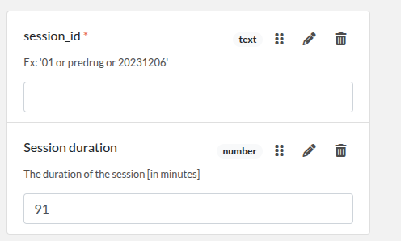
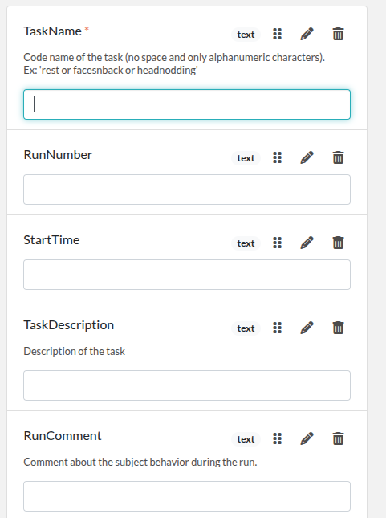
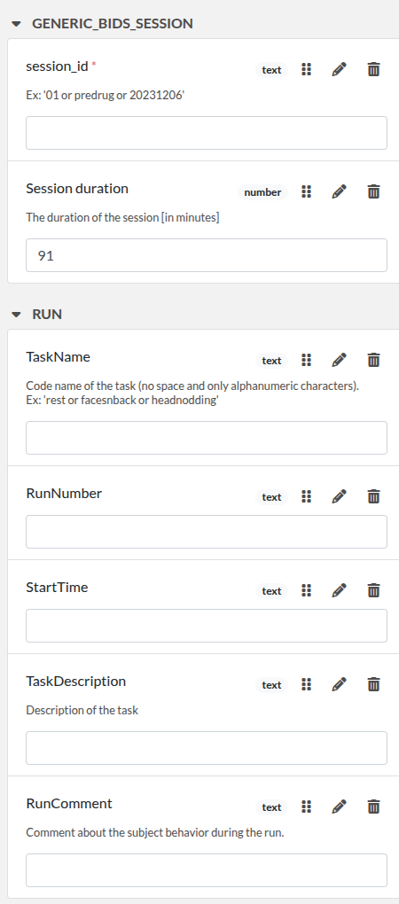

# elabforms

A set of tools to create and manage standardized forms for **eLabFTW**.

---

## 📦 Installation

We recommend using a virtual environment to avoid conflicts with other Python packages.

You could  also use **Python 3.8 or higher**.

### 1. Clone the `elabforms` repository:

```bash
git clone git@github.com:INT-NIT/elabforms.git
cd elabforms
pip install -r requirements.txt
```

### 2. Clone the templates repositories:

```bash
git clone git@github.com:INT-NIT/elabforms_INTProjects.git
git clone git@github.com:INT-NIT/elabforms_BIDSMetadata.git
```

---

## 🚀 Usage

To create a full template for a project (e.g., **Micr-2photon**), run:

```bash
python elabforms/src/cli.py \
elabforms_INTProjects/full_template/Micr-2photon/liste_template_part.csv \
elabforms_INTProjects/full_template/Micr-2photon/Micr-2photon.json
```

### 🔍 Explanation:

* `liste_template_part.csv`: A CSV file listing template parts to concatenate, one per line.
* `Micr-2photon.json`: The output JSON file containing the full concatenated template.

---

## 🧪 Example

Assume you have a file `liste_template_part.csv` with:

```csv
template_part_Example_1.json
template_part_Example_2.json
```

Run:

```bash
python elabforms/src/cli.py liste_template_part.csv full_template_example.json
```

### Example input: `template_part_Example_1.json`



```json
{
  "elabftw": {
    "extra_fields_groups": [
      {
        "id": 1,
        "name": "GENERIC_BIDS_SESSION"
      }
    ]
  },
  "extra_fields": {
    "session_id": {
      "type": "text",
      "value": "",
      "group_id": 1,
      "position": 0,
      "required": true,
      "description": "Ex: '01 or predrug or 20231206'"
    },
    "Session duration": {
      "type": "number",
      "value": "",
      "group_id": 1,
      "position": 3,
      "description": "The duration of the session [in minutes]",
      "blank_value_on_duplicate": true
    }
  }
}
```

### Example input: `template_part_Example_2.json`



```json
{
  "elabftw": {
    "display_main_text": true,
    "extra_fields_groups": [
      {
        "id": 2,
        "name": "Run "
      }
    ]
  },
  "extra_fields": {
    "TaskName": {
      "type": "text",
      "group_id": 2,
      "position": 0,
      "description": "Code name of the task (no space and only alphanumeric characters).\nEx: 'rest or facesnback or headnodding'"
    },
    "RunNumber": {
      "type": "text",
      "value": "",
      "group_id": 2,
      "position": 2
    },
    "StartTime": {
      "type": "text",
      "value": "",
      "group_id": 2
    },
    "RunComment": {
      "type": "text",
      "value": "",
      "group_id": 2,
      "position": 3,
      "description": "Comment about the subject behavior during the run."
    },
    "TaskDescription": {
      "type": "text",
      "value": "  ",
      "group_id": 2,
      "position": 1,
      "description": "Description of the task"
    }
  }
}
```

---

## 📟 Output

This will generate a file called `template_generated.json`:



```json
{
  "elabftw": {
    "extra_fields_groups": [
      {
        "id": 1,
        "name": "GENERIC_BIDS_SESSION"
      },
      {
        "id": 2,
        "name": "Run "
      }
    ]
  },
  "extra_fields": {
    "session_id": {
      "type": "text",
      "value": "",
      "group_id": 1,
      "position": 0,
      "required": true,
      "description": "Ex: '01 or predrug or 20231206'"
    },
    "Session duration": {
      "type": "number",
      "value": "91",
      "group_id": 1,
      "position": "3",
      "description": "The duration of the session [in minutes]",
      "blank_value_on_duplicate": true
    },
    "TaskName": {
      "type": "text",
      "group_id": 2,
      "position": 0,
      "description": "Code name of the task (no space and only alphanumeric characters).\nEx: 'rest or facesnback or headnodding'"
    },
    "RunNumber": {
      "type": "text",
      "value": "",
      "group_id": 2,
      "position": 2
    },
    "StartTime": {
      "type": "text",
      "value": "",
      "group_id": 2
    },
    "RunComment": {
      "type": "text",
      "value": "",
      "group_id": 2,
      "position": 3,
      "description": "Comment about the subject behavior during the run."
    },
    "TaskDescription": {
      "type": "text",
      "value": "  ",
      "group_id": 2,
      "position": 1,
      "description": "Description of the task"
    }
  }
}
```

---
